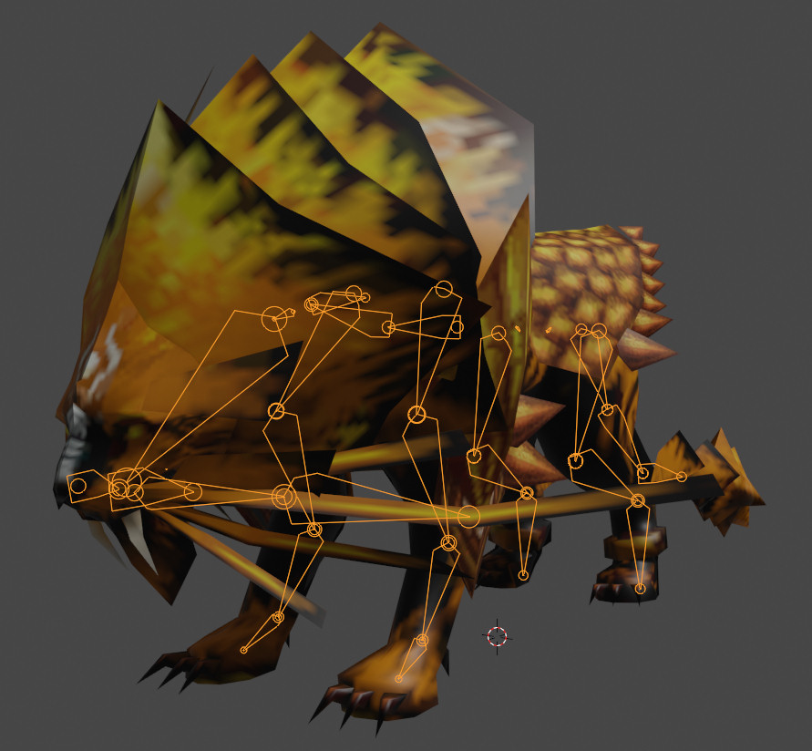

## God Summoner Mesh Importer for Blender

The **God Summoner Mesh Importer** is a Python script designed to import 3D models from the PC game **God Summoner** into Blender. This tool enables you to load and work with game assets, including mesh data, textures, and skeletons, for visualization or modification within Blender.

### Table of Contents

- [Features](#features)
- [Installation](#installation)
- [Usage](#usage)
- [Known Issues](#known-issues)

---

### Features

- **Model Importing**: Supports `.sm` (static mesh) and `.skin` (skinned mesh) file formats.
- **Skeleton Support**: Imports bone data into an armature for skeletal animation.
- **Texture Mapping**: Automatically locates and applies `.dds` textures if available.
- **Customizable Scale**: Easily adjust the scale of imported models.
- **Scene Management**: Option to clear the current scene before importing new models.
- **Vertex Weights**: Option to import vertex weights for rigged models.

---

### Installation

1. **Download the Script**: Obtain the `GodSummonerMeshImporter.py` Python script file.

2. **Open the Script in Blender**:
   - Open Blender.
   - Go to **Scripting** tab in Blender's top bar.
   - Either paste the contents of the `GodSummonerMeshImporter.py` script into the **Text Editor** or **Open** the script file using the **Open Text Block** button.

3. **Run the Script**:
   - Press the **Play** icon (triangle button) in the **Text Editor**.
   - This will execute the script, and the import option will be available during the current Blender session.

4. **Access the Importer**:
   - After running the script, navigate to **File > Import > God Summoner (.sm, .skin)** to import your models.

---

### Usage

1. **Launch the Importer**:
   - After running the script, navigate to **File > Import > God Summoner (.sm, .skin)**.

2. **Configure Import Settings**:
   - **Clear Scene**: Check this option if you want to delete all objects in the current scene before importing.
   - **Scale**: Adjust the scale factor of the imported model. The default is set to `0.00254`.
   - **Vertex Weights**: Enable this option to import vertex groups and apply bone weights to skinned models.
   - **Armature Name**: Set the name of the armature object that will receive the imported skeleton.

3. **Import a Model**:
   - Select the `.sm` or `.skin` file you want to import.
   - The script will automatically attempt to locate associated `.dds` texture files and `.skel` skeleton files in the same directory.

4. **View Your Model**:
   - The imported model will appear in the scene with textures (if available) and rigging (if importing a skinned mesh).
   - Use Blender’s built-in tools to modify, animate, or render the model.

---

### Known Issues

- **File Support**: Only `.sm` and `.skin` files are supported. The importer will skip unsupported file types.
- **Unknown Data Handling**: Some unknown data may cause issues during import, particularly in complex files.
- **Normals and Vertex Data**: Normals and certain vertex data are not fully decoded, which may result in incorrect appearance for some meshes.
- **Compression**: The importer does not handle compressed files (e.g., `lzo1x`). Files must be decompressed before importing.
- **Vertex Weights**: There may be inaccuracies when applying bone weights to complex models due to incomplete data interpretation.

---

*This script is provided as-is without any warranty. Use at your own risk.*
